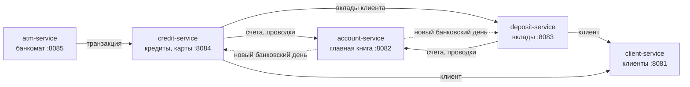

# Современные технологии программирования масштабируемых приложений

Лабораторные работы магистратуры БГУИР (кафедра ПОИТ), преподаватель — Хмелёва А. В.
Сквозная тема курса — информационная система условного банка **BankEt**, собранная из
микросервисов на Java и Spring. Интерфейс — на русском, английском и белорусском языках.

## О дисциплине

Курс посвящён проектированию приложений, которые можно развивать и масштабировать по частям:
каждая лабораторная работа добавляет к системе новый модуль, не переписывая предыдущие.

| Раздел | Что отрабатывается |
|---|---|
| **REST-микросервис** | Spring Boot, схема данных со справочниками, валидация на клиенте и в сервисе |
| **Взаимодействие сервисов** | REST между сервисами, идемпотентность, атомарность, устойчивость к сбоям |
| **Банковский учёт** | План счетов, двойная запись, активные и пассивные счета, банковский день |
| **Финансовые расчёты** | Проценты по вкладам, аннуитетные и дифференцированные графики платежей |
| **Протоколы и автоматы** | Конечный автомат сеанса банкомата, транзакционный протокол «банк — банкомат» |
| **Локализация** | Три языка: словари в браузере и на сервере, передача языка между сервисами, хранимые коды текстов |
| **Тестирование** | Модульные, интеграционные (MockMvc + H2) и функциональные (Selenium WebDriver) тесты |

Вариант — **4**: чётный и с остатком 1 от деления на 3 (состав полей клиента в ЛР1),
банк «Решение» — образец депозитных и кредитных программ в ЛР2–ЛР3.

---

## Лабораторные работы

### 👤 [ЛР №1: Модуль «Клиенты»](labs_info/lab1.md)

**Тема**: микросервис ввода и модификации данных о клиентах банка

REST-сервис на Spring Boot с базой H2 в памяти, четыре справочника для полей-списков,
web-клиент на Vue 3 с масками ввода. Значения проверяются дважды — в браузере и в сервисе;
паспорт и идентификационный номер уникальны. 158 тестов, из них 37 функциональных проходят
программу защиты в браузере через WebDriver и сверяют результат с таблицей в базе.

📄 Отчёт: [reports/lab1/main.pdf](reports/lab1/main.pdf) · код: [client-service/](client-service)

### 🏦 [ЛР №2: Депозитные операции](labs_info/lab2.md)

**Тема**: вклады физических лиц, план счетов, закрытие банковского дня

Два сервиса: главная книга ([account-service/](account-service)) — план счетов, 13-значные
счета с контрольным ключом, атомарные идемпотентные проводки, фонд развития банка — и
депозиты ([deposit-service/](deposit-service)) — отзывный вклад с ежемесячной выплатой
процентов и срочный безотзывный с выплатой в конце срока. Проводки выполняются по схеме
из задания, закрытие дня построено как оповещение сервисов-участников.

📄 Отчёт: [reports/lab2/main.pdf](reports/lab2/main.pdf)

### 💳 [ЛР №3: Кредитные операции](labs_info/lab3.md)

**Тема**: кредиты физических лиц, графики платежей

Сервис [credit-service/](credit-service): кредит с аннуитетным погашением и кредит с
ежемесячной уплатой процентов и возвратом долга в конце срока, предварительный расчёт
графика, платежи в дату их наступления при закрытии дня. В отчёте по счетам — счета
депозитных и кредитных программ вместе.

📄 Отчёт: [reports/lab3/main.pdf](reports/lab3/main.pdf)

### 🏧 [ЛР №4: Эмулятор банкомата](labs_info/lab4.md)

**Тема**: клиентский интерфейс банкомата и протокол общения с банком

Сервис [atm-service/](atm-service): сеанс работы — конечный автомат, вводимые данные
копятся во «внутреннем списке» и уходят банку одной транзакцией. Авторизация по PIN-коду с
тремя попытками, снятие наличных, остатки кредитного и депозитного счетов, оплата мобильной
связи, чеки. PIN-код хранится в банке только в виде хеша BCrypt. Для знакомства с банкоматом
после запуска выпускаются три демонстрационные карты (см. ниже).

📄 Отчёт: [reports/lab4/main.pdf](reports/lab4/main.pdf)

---

## Архитектура



У каждого сервиса своя база H2 в памяти и свой web-клиент; сервисы общаются только по REST.
Деньги учитывает один сервис — главная книга: правила сальдо, запрет отрицательного остатка,
атомарность и идемпотентность проводок реализованы в одном месте и одинаково действуют для
вкладов, кредитов и операций банкомата.

| Модуль | Назначение |
|---|---|
| `client-service` | клиенты и справочники (ЛР1) |
| `account-service` | план счетов, счета, проводки, банковский день (ЛР2) |
| `deposit-service` | депозитные программы и договоры (ЛР2) |
| `credit-service` | кредитные программы, графики, карты, процессинг банкомата (ЛР3, ЛР4) |
| `atm-service` | эмулятор банкомата (ЛР4) |
| `bank-common` | формат ошибок, локализация и REST-клиенты смежных сервисов |
| `ui-kit` | общие стили, выбор языка и помощники web-клиентов, Vue 3 из webjar |

## Быстрый старт

Нужны только JDK 17+ и доступ в интернет при первой сборке: wrapper `./mvnw` сам скачает Maven и зависимости.

```bash
./mvnw -DskipTests package
```

```bash
scripts/run-all.sh
```

Команды выполняются из корня репозитория. После запуска открыть
[http://localhost:8081](http://localhost:8081) — из шапки доступны все пять web-клиентов и
переключатель языка (Рус / Eng / Бел). Остановка:

```bash
scripts/stop-all.sh
```

Сценарий для знакомства: добавить клиента → «Депозиты»: заключить договор → «Кредиты»:
заключить договор → «Счета»: закрыть 30 дней и посмотреть отчёт → «Банкомат»: вставить
демо-карту, снять наличные.

### Демо-карты для банкомата

Через несколько секунд после запуска сервис кредитов сам заключает три кредитных договора и
выпускает к ним карты с известными PIN-кодами. Они показаны на странице банкомата
([http://localhost:8085](http://localhost:8085)) — карта «вставляется» кнопкой.

| Номер карты | PIN-код | Держатель | Кредит |
|---|---|---|---|
| 9112 3800 0000 0010 | 1111 | Лебедевич Артем Владимирович | 5 000 BYN |
| 9112 3800 0000 0028 | 2222 | Савицкая Марина Олеговна | 3 000 BYN |
| 9112 3800 0000 0036 | 3333 | Жуков Дмитрий Александрович | 10 000 BYN |

После трёх неверных PIN-кодов карта блокируется; разблокировать — «Кредиты» → договор →
«Перевыпустить PIN». У карт договоров, заключённых через форму, PIN-код случайный и
показывается один раз в «ПИН-конверте». Запуск без демо-карт:

```bash
BANK_DEMO_ENABLED=false scripts/run-all.sh
```

Один сервис можно запустить отдельно, например только модуль первой работы:

```bash
scripts/run-all.sh client
```

Таблицы любого сервиса видны в консоли H2: `http://localhost:<порт>/h2-console`,
JDBC URL — `jdbc:h2:mem:clients` (`accounts`, `deposits`, `credits`), пользователь `sa`.

Стартовый капитал фонда развития банка задаётся переменной окружения (в ЛР2 — 1 млн,
по умолчанию 100 млрд, как требует ЛР3). Чистый старт для сценария ЛР2:

```bash
BANK_FUND_CAPITAL_BYN=1000000 BANK_DEMO_ENABLED=false scripts/run-all.sh
```

### Языки

Язык выбирается в шапке и запоминается в cookie, общей для всех пяти web-клиентов. Подписи
и первичная проверка переводятся в браузере (`i18n.js`), сообщения сервисов — на сервере
(`messages*.properties`) по заголовку `Accept-Language`, который сервисы передают друг
другу. Справочники хранят наименования на трёх языках, а названия проводок записываются в
главную книгу кодом и переводятся при чтении.

## Тесты

```bash
./mvnw verify
```

Выполняются 359 тестов: модульные — на фазе `test`, интеграционные и функциональные
(классы `*IT`) — на фазе `verify`. Функциональным тестам нужен установленный Chrome;
драйвер Selenium скачивает сам. Если Chrome недоступен, они пропускаются.

| Модуль | Модульные | Интеграционные | Функциональные |
|---|---|---|---|
| `bank-common` | 10 | — | — |
| `client-service` | 73 | 48 | 37 |
| `account-service` | 7 | 18 | — |
| `deposit-service` | 13 | 38 | — |
| `credit-service` | 18 | 60 | — |
| `atm-service` | 28 | 5 | 4 |

## Структура репозитория

```
pom.xml, mvnw            многомодульный проект Maven и wrapper
client-service/          ЛР1: клиенты
account-service/         ЛР2: главная книга
deposit-service/         ЛР2: депозиты
credit-service/          ЛР3: кредиты; ЛР4: банковская сторона протокола банкомата
atm-service/             ЛР4: эмулятор банкомата
bank-common/, ui-kit/    общий код сервисов и web-клиентов
scripts/                 запуск сервисов, съёмка экранов и генерация приложений отчётов
labs_info/               условия и разбор реализации (markdown)
preamble.tex             общее оформление LaTeX по СТП БГУИР 01-2024
reports/lab1..lab4/      отчёты: main.tex, собранный main.pdf, иллюстрации
info_from_courator_2026/ условия лабораторных работ от преподавателя
```

## Сборка отчётов

```bash
cd reports/lab1 && tectonic main.tex
```

Отчёты собираются движком XeTeX (`tectonic`), шрифт — системный Times New Roman.
Приложения с полным текстом кода и иллюстрации генерируются из актуального состояния
репозитория:

```bash
python3 scripts/gen_listings.py
```

```bash
scripts/make-screenshots.sh
```

Второй скрипт поднимает сервисы с чистой базой и проходит сценарии всех работ в Chrome без
окна (нужен `uv`). Листинги с итогами тестов в отчётах обновляет `scripts/test_listings.py`
по журналу `./mvnw verify > logs/verify.log`.
